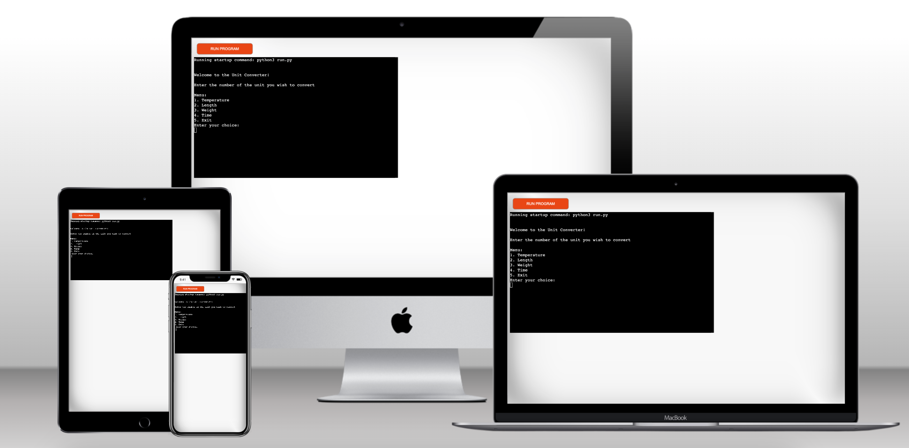
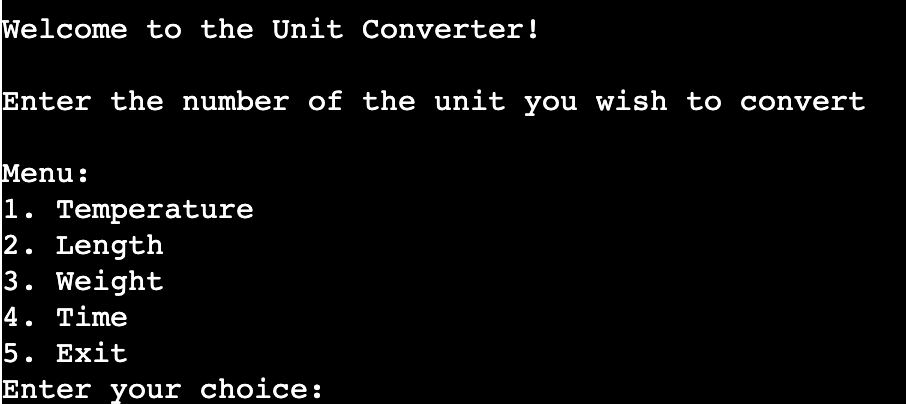
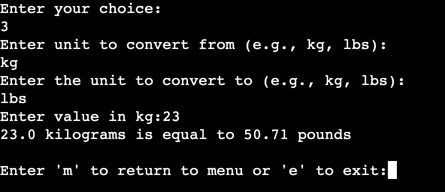
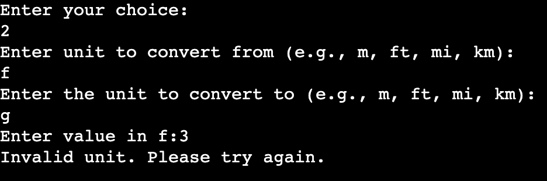
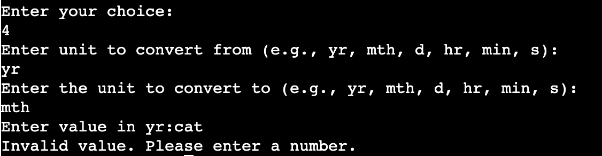

# Unit Converter 

Unit Converter is a terminal program in Python, deployed onto the Code Institutes mock terminal on Heroku. 

The program is built to help the user convert between some common units used in everyday life. 

[Find the deployed Unit Converter here](https://unit-converter-db3f55df0db8.herokuapp.com/)

## Table of Contents

+ [UX](#ux "UX")
  + [Site Purpose](#site-purpose "Site Purpose")
  + [Site Goal](#site-goal "Site Goal")
  + [Who is the user?](#user "Who is the user?")
+ [Features](#features "Features")
  + [Menu](#menu "Menu")
  + [Conversion](#conversion "Conversion")
  + [Validation](#validation "Validation")
+ [Data Model](#data-model "Data Model")
+ [Testing](#testing "Testing")
  + [Bugs](#bugs "Bugs")
+ [Deployment](#deployment "Deployment")
+ [Credits](#credits "Credits")

## UX

### Site Purpose 

Unit Converter is a program built to help the user convert between some common units used in everyday life, such as temperature, length, weight, as well as calculate between different time units. 

### Site Goal 

The goal of the site is to help the user convert between units which occur in everyday life. In temperature, length and weight, there is the imperial units versus the SI-units. The site has the ability to convert between these to assist the user. 

### Who is the user? 

The program is built for anyone what wishes to convert between different units, as we come across different units in our everyday life, depending on where we are in the world or where commerical material comes from which we consume. 

## Features 

### Menu 

When opening the program, the user is welcomed by a welcome prompt, followed by the prompt of putting in the number of the unit which the user wish to convert. The menu consists of 5 choices, with a number representing each unit, as well as the option of 'Exit' in case the user wants to shut down the program. 

### Conversion 

By choosing the number of the unit you want to convert, a prompt will appear that asks you to put in the unit you want to convert from, followed by a prompt of which unit you want to convert to. Following, a prompt asks you to put in the value which you want to convert. The program then presents the converted value, followed by a prompt asking if you want to reutrn to the menu for another conversion, or if you want to exit the program. 

### Validation 

The program can validate if the user input it correct or incorrect. 

By validating the unit input, the program can tell you if you have put in an invalid unit. 

The program also checks if it is a number that is being put in by the user for the conversion, so in case a user would put in a letter or invalid symbol, it will tell you this and let you return to the menu. 

## Data Model 

The conventions of building a unit converter in Python differs between two main methods. Either creating a dictionary with the functions that you put in a function and then extract from, or defining a function for every single unit.
In this program, the dictionary method was chosen, as it was considered easier to read and find the functions in the script, which also would assist if the need to modify or add functions would appear. 

## Testing 

I have tested this code through the following steps: 

+ Put the code through the [PEP8 Python Validator](https://pep8ci.herokuapp.com/) provided from the code institute
+ Tried the validation process by giving the program invalid inputs: invalid units and strings where numbers are expected
+ Tested in local terminal and in the deployed Heroku terminal 

### Bugs

Solved bugs: 

+ When initially deploying the program, if an invalid unit was put in the program, the whole program would exit instead of giving the option of returning to the menu. This due to a flaw in the way the try-loop was nested within the function. 
+ At one point, the "Invalid unit. Please try again." would return even if you put in an accurate number. This due to a flaw in how the functions called to the dictionary. This is now resolved. 

Remaining bugs: 

+ At the current stage, the program will let you put in any letter in the prompt asking for the unit which you wish to convert from and to, and not warn of the "Invalid unit." until a number is being put in. It will not make a conversion, but it would be desirable that the program warned straight away that you have put in an invalid unit. 

## Deployment 

This program was deployed to the Code Institutes mock terminal on Heroku, through the following steps: 

+ On the Dashboard on your Heroku-profile, choose the option "Create new app" 
+ Choose a name for the app you want to deploy
+ In Settings, put in the Config Vars necessary for deployment of your app. 
+ In Deploy, connect your GitHub-repository to Heroku.
+ Click on Deploy Branch. The app is now being built. 

